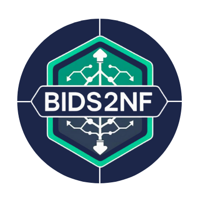

# bids2nf

<table>
  <tr>
    <td></td>
    <td>
      <b>bids2nf</b> is a Nextflow-native utility that ingests BIDS (Brain Imaging Data Structure) datasets and emits Nextflow channels for seamless integration into your neuroimaging pipelines. For parsing, it leverages <a href="https://github.com/CoBrALab/libBIDS.sh">libBIDS.sh</a>, a lightweight, shell-based BIDS parser.
    </td>
  </tr>
</table>


[](https://agah.dev/bids2nf) [](https://github.com/agahkarakuzu/bids2nf/actions/workflows/test.yml)

## Features

- **Lightweight BIDS parsing:** Validates (TBD) and reads BIDS datasets for use in Nextflow.
- **Flexible grouping:** Supports entity-based grouping (e.g., by subject, session, modality).
- **Customizable configuration:** Use `bids2nf.yaml` to tailor grouping and parsing to your workflow.
- **Cross-platform:** Works on macOS and Linux (see notes for macOS users below).
- **Easy integration:** Designed to plug into any Nextflow DSL2 pipeline.

## Installation

1. **Install Nextflow**  
   Follow the [Nextflow installation guide](https://www.nextflow.io/docs/stable/install.html).

2. **Clone this repository with its submodules**
   ```
   git clone --recurse-submodules https://github.com/agahkarakuzu/bids2nf.git
   ```
    * Submodules
        * [CoBrALab/libBIDS.sh](https://github.com/CoBrALab/libBIDS.sh)   (for parsing BIDS)
        * [bids-examples](https://github.com/bids-standard/bids-examples) (for testing purposes)

> [!IMPORTANT]
> 🍎 users to use libBIDS locally:  The default bash version on macOS (either Intel or Apple Silicon) does not meet libBIDS requirements. Install a newer bash with Homebre (`brew install bash`), then set `process.shell` in `nextflow.config` to `/opt/homebrew/bin/bash` (Apple Silicon) or `/usr/local/bin/bash` (Intel Macs).

- Entities to group by (e.g., subject, session)
- File selection patterns
- Output structure

## Usage

1. **Prepare your BIDS dataset** in a directory (see `test/data/` for examples).
2. **Configure** your `bids2nf.yaml` and `nextflow.config` as needed.
3. **Run your Nextflow pipeline**:
   ```bash
   nextflow run main.nf --bids_dir /path/to/bids_dataset
   ```
   
>[!WARNING]
> Current `main.tf` is a WIP, so is the entire project.

## Configuration: `bids2nf.yaml`

TBE.

## Supported Patterns

**bids2nf** offers a range of pre-configured patterns designed to meet the requirements of various neuroimaging workflows.

### Common rules

#### Core channel-defining entities: `sub`, `ses` and `run`

These entities form the primary grouping structure and determine channel multiplicity.

For example:

* Subject only: [subject] (when session/run are "NA")
* Subject + Session: [subject, session] (when run is "NA")
* Subject + Session + Run: [subject, session, run] (when all entities exist)
* Subject + Run: [subject, run] (when session is "NA" but run exists)

> [!NOTE]
> Add `task` as well? 

### Entity based grouping

TBE.

### Another pattern.


## Contributing

Contributions are welcome! Please open issues or pull requests to help improve bids2nf.