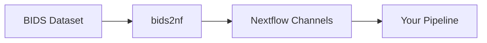

# Project Basics

## How bids2nf Works

bids2nf acts as a bridge between BIDS datasets and Nextflow pipelines. It reads your BIDS dataset, groups files according to your specifications, and emits Nextflow channels that your pipeline can consume.



## Core Concepts

### Entities

BIDS uses **entities** to organize neuroimaging data. Common entities include:

- `sub` (subject): Individual participants
- `ses` (session): Recording sessions  
- `run`: Multiple acquisitions of the same type
- `flip`: Flip angle for MRI sequences
- `echo`: Echo time for multi-echo sequences
- `task`: Experimental tasks

### Channel-Defining Entities

bids2nf uses **core channel-defining entities** (`sub`, `ses`, `run`) to determine how data is grouped into Nextflow channels:

- **Subject only**: `[subject]` (when session/run are absent)
- **Subject + Session**: `[subject, session]` (when run is absent)  
- **Subject + Session + Run**: `[subject, session, run]` (when all exist)
- **Subject + Run**: `[subject, run]` (when session is absent but run exists)

### File Grouping

bids2nf groups files in two main ways:

1. **Named Sets**: Specific combinations of entities that must exist together
2. **Sequential Sets**: Files that vary by a single entity (like flip angles)

## Integration with Nextflow

bids2nf emits structured channels that contain:
- **Metadata**: Subject, session, run information
- **File paths**: Organized according to your grouping rules
- **Additional data**: Custom fields from your configuration

Your Nextflow pipeline receives these channels and can process them using standard Nextflow DSL2 patterns:

```nextflow
workflow {
    bids2nf_output = BIDS2NF(params.bids_dir)
    
    // Process each channel element
    PROCESS_DATA(bids2nf_output)
}
```

## libBIDS.sh Integration

Under the hood, bids2nf uses [libBIDS.sh](https://github.com/CoBrALab/libBIDS.sh) for:
- BIDS dataset validation
- Entity parsing and extraction
- File pattern matching
- Cross-platform compatibility

This keeps bids2nf lightweight while providing robust BIDS parsing capabilities.